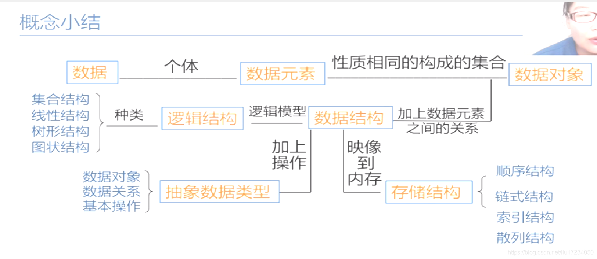
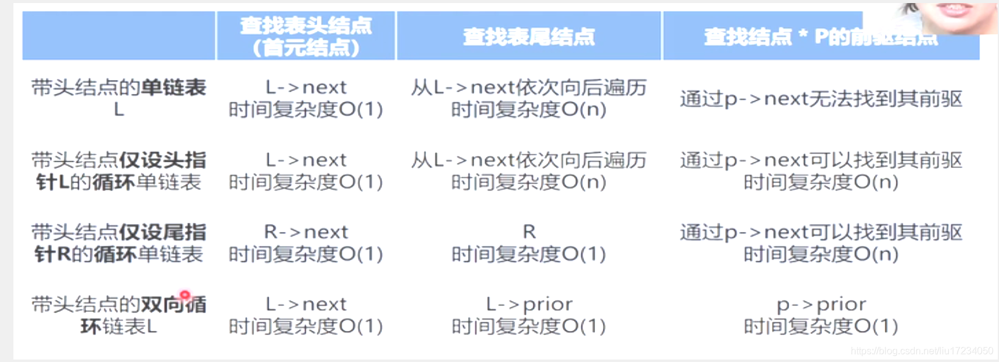
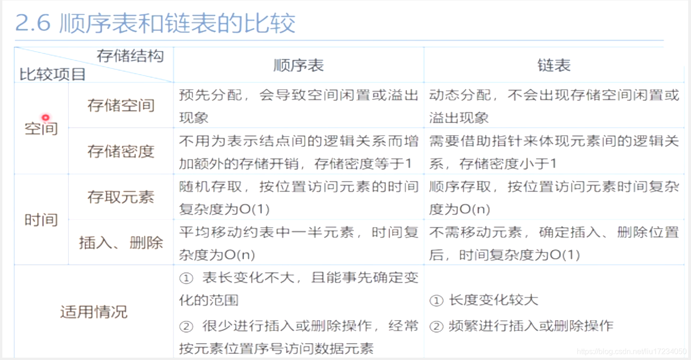
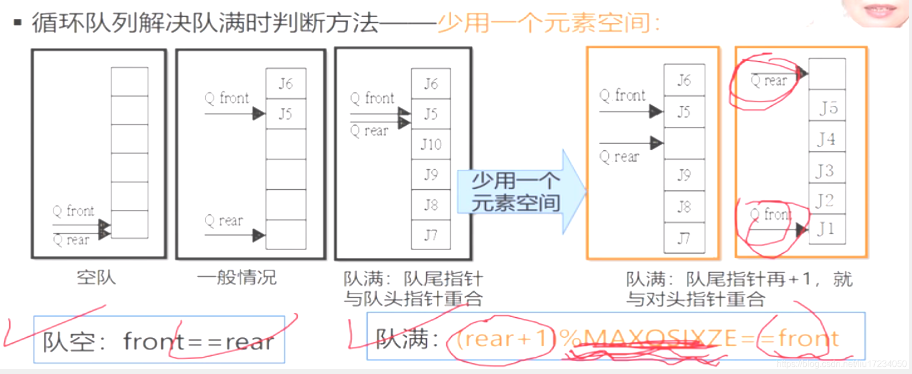
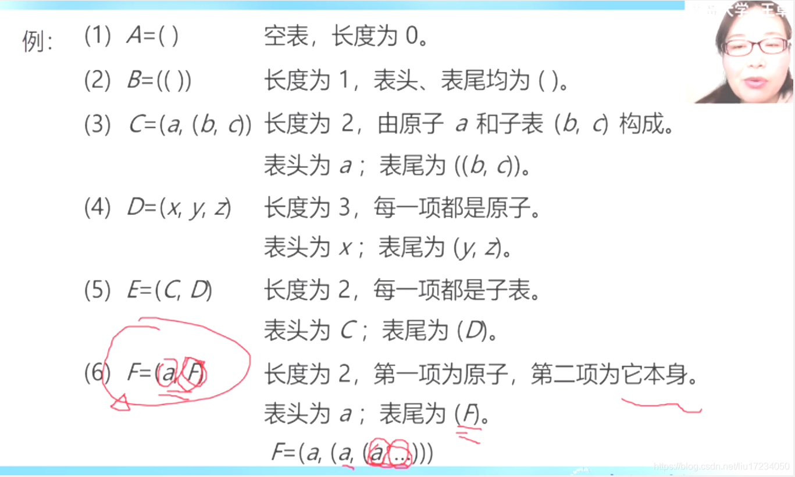
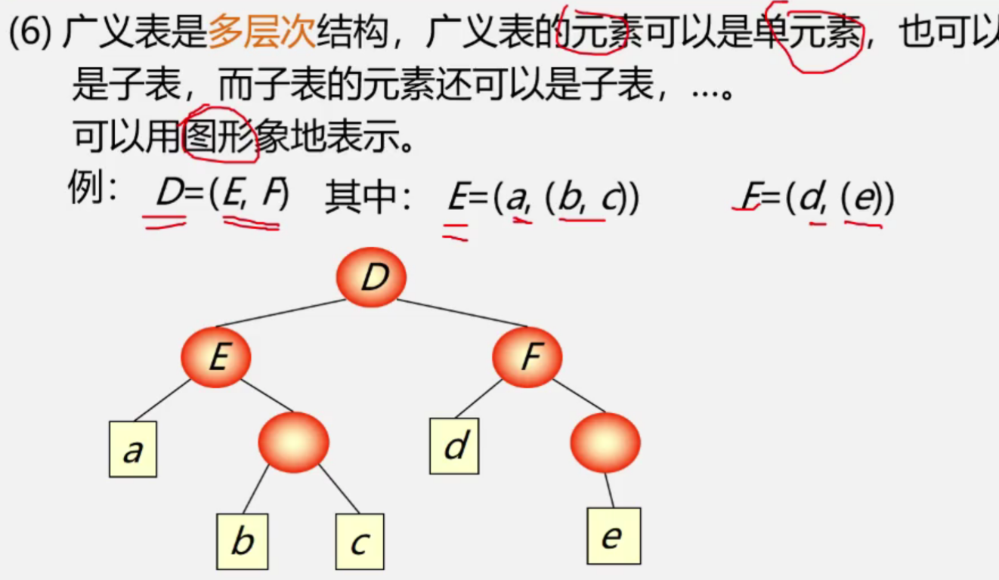

# 数据结构与算法

## Ch1_数据结构的基本概念

### 基本概念和术语

- 数据、数据元素、数据项、数据对象
  - 数据(Data)：是指客观事物的符号化表示。
  - 数据元素(Data Element)：是数据的基本单位。比如说 一名学生的记录。
  - 数据项(Data Item)：是组成数据元素的最小单位。比如说 一名学生记录中的姓名、学号、性别都分别是1个数据项
  - 数据对象(Data Object)：是具有相同性质的数据元素的集合。比如说，所有学生的记录就是一个数据对象
- 什么是数据结构
  - 是指相互之间存在一种或多种特定关系的数据元素的集合
  - 或者说，数据结构是带结构的数据元素的集合
- **数据结构的两种层次**
  - **逻辑结构**：
    描述数据元素之间的逻辑关系；
    与数据的存储无关，独立于计算机；
    是从具体问题抽象出来的数学模型；
    - 1.线性结构
    （一对一）
      - 定义：有且仅有一个开始和一个终端结点，并且所有结点都最多只有一个直接前趋和一个直接后继
      - 分类
        - 一般线性表：线性表
        - 特殊线性表：栈、队列、串
        - 线性表的推广：广义表，数组
    - 2.非线性结构
      - 定义：一个结点可能有多个直接前趋和直接后继
      - 分类：
        - 树：一对多
        - 图：多对多
        - 集合：无关系
  - **存储结构（物理结构）**
    数据元素及其关系在计算机存储器中的结构（存储方式）
    - 1.顺序存储结构
      - 定义：数据元素在存储器中占用一段连续的存储单元
      - 优点：随机查找快，存储密度高
      - 缺点：插入删除需移动大量元素
    - 2.链式存储结构
      - 定义：数据元素在存储器中不一定是连续的，数据元素之间通过指针连接
      - 优点：插入删除方便，不需移动元素
      - 缺点：存储密度低，只能顺序查找
- 数据类型和抽象数据类型
  - 数据类型：是一个值的集合和定义在该值上的一组操作。比如int、char、float等
  - 抽象数据类型（ADT）：是由用户定义的数学模型，以及定义在该模型上的一组操作的总称。
    - 1. 数据对象：数据元素的集合
    - 2. 数据关系：数据元素之间的逻辑关系
    - 3. 基本操作：对数据对象进行操作的方法和步骤
- 概念小结：
  - 

### 算法和算法分析

- 算法的定义：对特定问题求解方法和步骤的一种描述，它是指令的有限序列。对解决问题的方法的描述
- 算法的描述方法
  - 1. 自然语言：英语、中文
  - 2. 流程图：传统流程图、NS流程图
  - 3. 伪代码：类C语言
  - 4. 程序代码：C语言，C++语言程序
- 算法的特性
  - 1. 有穷性：一个算法总是在执行有穷步骤后结束
  - 2. 确定性：算法中的每一条指令必须有确切的含义，没有二义性
  - 3. 可行性： 算法是可执行的
  - 4. 输入：一个算法有0个或者多个输入
  - 5. 输出：输出待求结果
- 算法设计的要求
  - 1. 正确性：
        - 没有语法错误
        - 对于精心选择的，苛刻的刁难的数据也能输出正确的结果
        - 程序对于一切合法的输入数据都能得到正确的输出结果
  - 2. 可读性
  - 3. 健壮性
        - 指当输入非法数据的时候，算法能够恰当的做出反应或进行相应处理，而不是输出莫名其妙的结果
        - 处理出错的方法，不应是中断程序的执行，而应是返回一个表示错误或者错误性质的值，以便在更高抽象层次上进行处理
  - 4. **高效性**：
      要求花费尽量少的时间和尽量低的存储需求
        - **时间效率**：
          指的是算法所耗费的时间
            - 1. 事后统计：将算法实现运行，测算其时间和空间的开销
              - 缺点：1. 将算法转换为实际能够运行的程序需要花费大量的时间2. 所得到的测试结果依赖于计算的软硬件等环境因素因此——不常用
            - 2. **事前分析**：对算法所耗时间和空间资源的一种估计。
              算法运行时间 =一个简单操作所需的时间（如赋值、移动、比较）*简单操作次数简单来说，
              就是算法中每条语句执行时间之和更进一步，将单条语句的执行之间设定为单位执行时间，
              不考虑硬件和语言特性则算法的耗费时间定义为该算法中每条语句的频度之和
                  - 王卓老师视频截图
                  - 为了便于比较不同算法的时间效率，简化我们分析算法的时间耗度，我们一般仅比较他们的数量级
                  - **时间复杂度的概念**：
                  若有某个辅助函数f（n），使得当n趋近于无穷大时，T(n)/f(n)的极限值为不等于0的常数，
                  则称f(n)是T(n)的同数量级函数。
                  记作T(n)=O(f(n))，称O(f(n))为算法的渐进时间复杂度（O是数量级的符号），简称时间复杂度。
                    - 对于复杂的算法，我们可以将算法分成容易估算的几个部分然后利用加法规则和乘法规则计算算法总的时间复杂度
                      - 1. 加法规则 O(f(n))=O(f1+f2)
                      - 2. 乘法规则 O(f(n))=O(f1xf2)
        - 空间效率：指的是算法执行过程中所耗费的存储空间。涉及空间复杂度。
          - 注意：O(1)表示算法原地工作。

## Ch2_线性表

### 线性表的定义：零个或多个元素的有限序列
- 线性表只有一个表头和一个表尾
- 线性表中每一个元素最多只有一个前趋和一个后继
### 存储结构方式
- 1.顺序存储——**顺序表(Sequential List)**:
必须是占用一片连续的存储空间。中间有空出来的地址，都不能叫做线性表的顺序存储。
利用数据元素的存储位置表示线性表中相邻元素的前后关系；顺序存储的线性表其逻辑关系和存储关系是一致的。
  - 基本操作：
    - 1. 顺序线性表初始化算法实现
    - 2. 顺序线性表的取值：随机存取（时间复杂度O(1)）
    - 2. 顺序线性表清空、销毁算法实现
    - 3. 顺序线性表查找算法实现：（时间复杂度O(n)）
    - 4. 顺序线性表插入、删除算法实现（时间复杂度为O(n)）
  - 存储位置计算公式：
    - LOC(a_i) = LOC(a_1) + (i-1) * l
    - l为数据元素的存储长度，比如说int类型的长度为4字节，char类型的长度为1字节。
  - 平均查找长度公式：
    - ASL(Average Search Length) = ∑i=1~n (P(i) * C(i))
    - P(i)为查找元素的概率，C(i)为查找元素的比较次数
- 2.链式存储——**链表(Linked List)**:
  由一个个结点相互链接形成的数据存储结构；每一个结点由数据域和指针域组成；
  数据域负责存储元素的数值数据；指针域负责存储直接后继（以及前趋）结点的存储位置；
  - 分类：
    - 1.单链表（线性链表）
      - 每个结点只有一个数据域和一个指针域
    - 2.双链表（Double Linked List）
      - 每个结点有一个数据域和两个指针域
    - 3.循环链表（Circular Linked List）
      - 首尾相接的链表成为循环链表
    - 4.双向循环链表
      - 双向循环链表是双链表和循环链表的结合
  - 术语：
    - 头指针：一般是L
    - 头结点
    - 首元结点： 第一个结点（头结点之后的第一个结点）。一般是L->next
    - 尾指针：非循环链表的尾指针->next=NULL；循环链表的尾指针->next=L
    - 尾结点
  - 单链表的基本操作：
    - 1.链式线性表初始化算法实现
    - 2.链式线性表的取值：顺序存取（时间复杂度O(n)），
    - 2.链式线性表清空、销毁算法实现
    - 3.链式线性表查找算法实现（时间复杂度O(n)）
    - 4.链式线性表插入算法（时间复杂度O(n)）
      - 头插法
      - 尾插法
    - 5.链式线性表删除算法实现（时间复杂度为O(n)）
  - 比较单链表、双向链表和循环链表：
    - 
- 比较顺序表和链表：
  - 
### 案例分析
- 一元多项式的运算：适合顺序表
- 稀疏多项式的运算：适合链表
- 图书馆的图书管理：
  - 如果图书馆的图书数量较多且需要频繁的插入和删除操作，使用链表；
  - 反之，如果图书馆的图书数量较少且需要频繁的查找操作，使用顺序表。
  
## Ch3_栈和队列
- 栈和队列是一种特殊的操作受限的线性表。
  栈只能从表尾插入元素，删除元素只能删除最后一个元素，秉持着先进后出的原则（LIFO）。
  队列只能从表尾插入元素，删除元素只能删除第一个元素，秉持着先进先出的原则（FIFO）。
  从数据结构角度，栈和队列都是线性表的特殊形式；
  从数据类型角度，栈和队列 与 线性表是不同的ADT。
- **栈**
  - 1.顺序结构栈
    - 常用，因为比较简单，清空和销毁都比较方便
  - 2.链式结构栈
  - 3.栈和**递归**
    - 我们熟知的递归函数就是使用了栈的一种方法。
      每一次函数的调用，变量和返回地址都会被保存在栈里最先调用的，最后拿出来。
  - 采用**递归**算法解决的问题：
    - 定义是递归的——采用分治法进行递归求解的三个条件：
      - 1. 能将一个问题转变成一个新问题，解法相同或者类似，处理对象更小且变化有规律
      - 2. 可通过上述转化使问题简化
      - 3. 必须有一个明确的递归出口，或称递归的边界
      - 比如：斐波那契数列（时间复杂度O(2^n)）
    - 数据结构是递归的：
      - 比如：链表LNode是指针套指针的结构体
    - 问题的解法是递归的（用递归比迭代更简单）：
      - 比如：汉诺塔问题（时间复杂度O(2^n)）
  - 递归的优缺点
    - 优点： 代码简洁，易读性高
    - 缺点： 时间复杂度高，空间复杂度高
    - 解决方法：转为非递归算法，通过保存好的状态来加速（比如全局变量）
- **队列**
  - 表尾插入、表头删除
    - 1. 顺序队列
      - 常用循环顺序队列（涉及到对maxqsize取模）
      - 循环顺序队列如何判断空队和满队？
        - 1. 设置一个标志flag
        - 2. 增加了一个变量对元素个数计数
        - 3. 教材使用方法：**少使用一个空间，让空队的判断条件是front==rear满队的判断条件为front == rear_next**
             - 
    - 2. 链式队列
      - 链式队列其实就是一种简化版的链表
        - 与链表的相同的地方
          - 初始化、添加、删除元素用的是同一种逻辑
        - 与链表不同的地方
          - 插入元素只能在表尾插，删除元素只能删除表头的元素
          - 定义的方式有些许不一样，导致后面函数的访问就不一样
- 案例分析：
  - 1.栈的应用
    - 数制转换
      - 进制转换：十进制转二进制、十六进制
      - 进制转换：二进制转十进制、十六进制
    - 1.表达式求值
      - 中缀表达式转后缀表达式
      - 后缀表达式求值
    - 2.括号匹配问题
      - 用栈来存储左括号，遇到右括号就出栈一个左括号
      - 如果栈空了，说明没有匹配的左括号
      - 如果栈不空，说明有多余的左括号
  - 2.队列的应用
    - 1.舞伴排队问题
    - 2.打印机排队问题
- 补充：卡特兰数递推式
  - 定义：表示n个数的出栈序列的个数
  - 公式：h(n) = ∑i=0~n-1 h(i) * h(n-i-1) = C(2n,n)/(n+1)
  - 例子：h(3) = 5, 意味着3个数的出栈序列有5种——123，132，213，231，321

## Ch4_串、数组、广义表
- 1.串：字符串的简称
  - 串的一些术语
    - 1. 子串：串中任意个**连续**字符组成的子序列成为该串的子串
    - 2. 主串：包含子串的串相应地称为主串
    - 3. 字符位置：字符在序列中的序号为该字符在串中的位置
    - 4. 子串位置：子串第一个字符在主串中的位置
    - 5. 空格串：由一个或多个空格组成的串，与空串是不一样的
    - 6. 串相等：当且仅当两个串的长度一样，且对应的字符都一一相等才能叫做串相等
  - 串的存储结构
    - 1. 顺序存储：简单，灵活。常用
    - 2. 链式存储：插入和删除比较方便，但是存储效率只有20%，太低了。
    （之所以是20%,是因为每个结点都要存储一个指针，指针的长度是4字节，而数据域为char类型，长度为1字节，所以存储密度= 1/(1+4) = 20%）
  - 串的模式匹配算法：
    - 1.暴力匹配算法(Brute Force,BF算法)：
      - 时间复杂度：O(n*m)，其中n为主串长度，m为子串长度。不过实际执行时近似于O(n+m)
    - 2.KMP算法：
      - 原始的KMP算法：用到next数组，
      - 改进的KMP算法：用到next数组和nextval数组
      - 时间复杂度：O(n+m)
- 2.数组
  - 1.二维数组的逻辑结构
    - 1. 可以看做是非线性结构：一个在二维数组的元素，可能不止有一个前趋和一个后继，因此不是一个线性结构
    - 2. 也可以看作是线性的。因为其实没有二维数组的概念，二维数组本质上是数组的数组，一维数组中每一个元素又是一维数组罢了
  - 2.二维数据的压缩存储方法
    - 1. 对称矩阵
      - 压缩存储方法：一般只存储下三角矩阵的元素（包括对角线），下三角矩阵是一个递增的等差数列：元素个数=n*(n+1)/2把这么多个数存在一行里。如果要解压缩，还是比较好推的
    - 2. 稀疏矩阵（矩阵中超过95%的元素都是0）
      - 压缩存储方式：用一个三元组表示稀疏矩阵中的非零元素三元组的前两个元素是表示元素的坐标，第三个元素是值本身
    - 3. 带状矩阵（对角矩阵）
      - 压缩存储方法：1. 每一条带（对角线）存一行2. 带状矩阵每一行非零的存一行（最前面几行和最后面几行要补0）
- 3.广义表
  - 广义表是线性表的推广线性表中的元素是单一的，而广义表中的元素可以是一种普通的数据类型也可以是广义表本身，有一种递归的潜质
    - 
  - 广义表的几种定义
    - 广义表的表头是第一个元素，表尾是除开第一个元素的剩余元素集合广义表的递归有些类似于链表
  - 广义表的一些术语
    - 1. 广义表的长度：最外层括号所包含的元素个数
    - 2. 广义表的深度：把广义表展开，括号对的重数。空表是深度为1，原子深度为0
    - 
    - 4. 一个非空广义表的表头可以是一个原子，也可以是一个广义表。但是广义表的表尾一定是一个表尾

## Ch5_树和二叉树
- 1.树的定义
  - 1.树的定义
    - n（n&gt;=0）个结点的有限集
      - 1. n=0时称为空树
      - 2. n&gt;=1时有且仅有一个结点称为树的根（root）其余结点可分为m(m&gt;=0)个互不相交的有限集合，T1,T2...其中每一个有限集合又可以看作是一个树，称为子树（sub-tree）
    - 常见的，我们写文章标题的分类，就是树的结构
  - 2.树的术语
    - 1. 根结点：非空树表中，没有直接前趋的结点就是根节点
    - 2. 结点的度：结点所包含的子树的个数
    - 3. 树的度：树内各结点的度的最大值
    - 
    - 4. 树的深度：树种结点层次的最大数，有时也叫树的高度
    - 5. 森林：m（m&gt;=0）互不相交的树的集合
  - 3.树和线性表之间的区别：
    - 1. 线性表的表头元素无前趋树的根节点无双亲
    - 2. 线性表的表尾元素无后继树的叶子无孩子
    - 3. 线性表中的元素只有一个前趋和一个后继：一对一的关系树中的结点是有一个双亲和多个孩子：一对多的关系
- 2.二叉树
  - 二叉树的存在意义：普通的树因为太复杂了，用计算机实现的话非常麻烦因此我们常用二叉树来使用树
  - 1.二叉树的定义：
    - 由一个根节点和两个互不相交的左子树和右子树构成的集合
      - 1. 二叉树的结点最多只有两个度，也即只有两个孩子
      - 2. 二叉树的子树是有左右之分的
      - 严格来说，二叉树不是树的特殊情况这是因为二叉树对子树的左右次序进行了严格的要求，即使只有一个子树，也要说明是左还是右|这是二叉树和树之间最大的差别
  - 2.二叉树的性质
    - 1. 二叉树的第i层中最多有2^(i-1)个结点最少也得有1个结点
    - 2. 深度为k的二叉树的结点总数最多为2^k - 1最少结点数为k
    - 3. 在一个二叉树中，设叶子数（没有分支）的个数为n0，度为2（有两个分支）的个数为n2则有n0 = n2 + 1证明：设二叉树的边线总数为 BB = n - 1B = 2*n2 + n1n = n0 + n1 + n2则有：n0 + n1 + n2 -1 = 2*n2 + n1n0 = n2 +1
    - 补充知识点
      - 1. 满二叉树：深度为k，结点总数为2^k-1(max)
        - 满二叉树的叶子数是同深度最多的，2^(k-1)
        - 满二叉树在同样深度的二叉树中，结点数是最多的
      - 2. 完全二叉树：从满二叉树的最后一个结点（二叉树顺序：从上到下，从左到右），依次连续的去掉结点的二叉树，才能叫完全二叉树
        - 完全二叉树和满二叉树的编号是一一对应的
        - 完全二叉树的叶子结点只能分布在第i层和第i-1层
        - 完全二叉树的某个结点的左子树的层数一定是右子树的同级后者下一级
      - 3. 具有n个结点的二叉树，有n+1个空指针域
    - 4. 具有n个结点的完全二叉树的深度k为：k = 向上取整（log2 n）
    - 5. 具有n个结点的完全二叉树，其结点i有如下性质
      - 1. i= 1：该结点是根节点
      - 2. i的双亲结点是 向下取整（i/2）
      - 3. 如果2*i &gt; n。那么该结点为叶子结点
      - 4. 如果2*i +1&gt;n。那么该节点没有右孩子
  - 3.二叉树的存储方式
    - 1. 顺序存储方式
      - 不常用，缺点如下：1. 顺序结构不能改变长度，插入和删除很慢2. 顺序结构表示非完全二叉树的时候，非常浪费空间
    - 2. 链式存储方式
      - 记一条性质：有n个结点的二叉树，其结点的链域为空的个数为n+1
  - 4.二叉树的遍历方式
    - 遍历二叉树时，我们选定一种遍历方式，比如说LDR中序遍历在遍历时，对每一个结点（子树）都采用该遍历方式
    - 已知遍历结果，能否反推二叉树的形状？
      - 1. 一种先序和中序可以反推
        - 先序的首元素一定是根结点那么，在中序中找到根结点，位于根结点之前的都是根结点的左子树，之后的都是右子树的再反复根据先序和中序确定每一个元素的位置
      - 2. 已知中序和后序可以反推
        - 后序（LRD）的尾元素一定是根结点那么，在中序中找到根结点，位于根结点之前的都是根结点的左子树，之后的都是右子树的再反复根据后序和中序确定每一个元素的位置
  - 5.二叉树的操作
    - 1. 二叉树的遍历
      - 1. 先序遍历DLR
      - 2. 中序遍历LDR
      - 3. 后序遍历LRD
      - 4. 中序遍历的非递归算法——使用栈保存结点信息
      - 5. 二叉树的层次遍历算法
        - BFS广度优先算法
        - 算法设计思路：    1.将根结点入队    2.队列不为空时循环，从队列中出列一个元素，访问它，并作以下步骤：        2.1 如果该元素的左孩子不为空，让该元素的左孩子入队        2.2 如果该元素的右孩子不为空，让该元素的右孩子入队
    - 2. 二叉树的创建
      - 1. 选定一个遍历方式。常用先序遍历DLR
      - 2. 使用递归函数，创建一个二叉树
      - 3. 设定一个输入的特定字符，用于判定当前创建的结点没有左右孩子
    - 3. 二叉树的复制
      - 同二叉树的创建操作基本一致
    - 4. 求二叉树的深度
      - 算法非常巧妙，还是递归函数的方式，只不过在函数内部有两个变量，用于保存当前的深度值，通过比较输出双亲的左或右孩子的深度值
    - 5. 求二叉树的结点数
    - 6. 求二叉树的叶子数
  - 6.线索二叉树
    - 1. 线索二叉树的定义
      - 如果一个二叉树的的结点的左指针域为空，那么我们将左指针指向这个结点的前驱如果结点的右指针为空，那么将右指针指向这个结点的后继这里的前驱和后继指的是输出序列中结点的前后关系哈
- 3.树和森林
  - 1. 树的存储方式
    - 1. 双亲表示法
      - 用一个数组存放一棵树，数组的元素是结构体，结构体的内容是树结点的内容，以及当前结点的双亲在数组中的下标
    - 2. 孩子链表法
      - 把每一层的每一个结点的孩子们看作是一个链表，然后用数组存储树的每一个结点（从上到下，从左到右）每个结点的孩子链表的数据域内容是孩子结点在数组中的位置
      - 这种存储方式，比较容易找到一个结点的孩子，但是不容易找到结点的双亲，那怎么样可以又快速找到双亲，又找孩子呢？答案就是将孩子链表和双亲表示法结合起来，得到一个双亲孩子链表表示方法
    - 3. 孩子兄弟表示法
      - 同二叉树的定义方式相似，定义一个数据域，两个指针域。左指针指向当前结点的孩子，右指针呢，指向当前结点的兄弟结点，没有就为空。
  - 2. 树和二叉树的转换方式
    - 树转换成二叉树
      - 借助与树的孩子兄弟链表表示法我们将树转换为二叉树几个字概括其转换方式：兄弟相连留长子
      - 
    - 二叉树转换成树
      - 口诀：左孩右右连双亲          去掉原来右孩线
      - 
  - 3. 树的遍历方式
    - 1. 先根（序）遍历：先访问树的根节点，再访问子树
    - 2. 后根（序）遍历：先访问树的子树，最后访问根结点
    - 3. 层次遍历
  - 4. 森林的遍历方式
    - 1. 先序遍历
      - 把森林拆分成一个个树，对树进行先根遍历
    - 2. 中序遍历
      - 把森林拆分成一个个树，对树进行后根遍历
- 4. 哈夫曼树
  - 1. 最优哈夫曼树的概念
    - 1. 先补充点知识
      - 1. 路径：树的结点与结点之间的连线就是路径
      - 2. 树的路径长度：从树的根节点到树的每个结点的路径长度之和
      - 3. 权重：叶子结点的权重系数
      - 4. 树的带权路径长度之和：从根节点到叶子结点的路径之和再乘以对应的叶子结点的权重系数
    - 2. 哈夫曼树就是带权路径长度之和最小的树，也即最优树
    - 3. 哈夫曼树不唯一，同一带权路径长度之和可以有多种二叉树形式
    - 4. 满二叉树不一定是哈夫曼树
    - 5. 哈夫曼树中权重越大的结点离根结点越近
  - 2. 哈夫曼树的构造
    - 1. 构造思路
      - 1. 删除两小造新人：把权重结点设定为只有根结点的一颗颗树，把这些树组成一个森林从树里面找到权重最小的两棵树，组成一颗新树，新树的权重是两小树的和在森林中删除这两个小树，保留新的合成树重复以上过程，直到森林变成一棵树
  - 3. 哈夫曼编码
    - 构造思路
      - 1. 由结点的权重构造一颗哈夫曼树（调用哈夫曼树构造函数）
      - 2. 从哈夫曼树的根节点开始，左边的路径是0，右边的路径是1，每一个的叶子结点的哈夫曼编码就此产生
  - 4. 哈夫曼解码
    - 解码思路
      - 1. 要通过哈夫曼编码算法得到哈夫曼的编码HC
      - 2. 有了字母对应的哈夫曼编码表，我们可以使用两种方式进行解码
        - 1. 不查表：用暗文的二进制码，代入到哈夫曼树中，根据哈夫曼编码的原则，从哈夫曼树的根节点开始向下，直到到达叶子结点，该叶子结点的就是对应的明文
        - 2. 查表：我们通过哈夫曼编码算法都已经得到一个明文-暗文的对照表了，那我们就可以使用BF或者KMP匹配算法在暗文中一点点的匹配对应的解码暗文，最终翻译整个暗文（我感觉这个速度应该有点慢、）
## 5. 图
- 1. 图的定义
  - 1. G=（V,E）V：顶点（数据元素）组成的有限非空集合E：边的有限集合
    - 1. 有向图，图的边是有方向的
    - 2. 无向图，图的边没有方向
    - 3. 完全图：图的任意两个点都有边相连
      - 无向图边的条数：n*(n-1)/2
      - 有向图边的条数：n*(n-1)
    - 4.稀疏图和稠密图
      - 稀疏图：图的边数量很少
      - 稠密图：图的边数量很多
    - 5. 图的度：图的顶点相关联的边的数目无向图中，一个顶点有几条边就是度多少有向图中，分为出度和入度，出度和入度加起来是度
    - 6. 图的路径：接续（连续的）边构成的顶点序列
    - 7.连通图：在一个图中，任意两个顶点V,U都能找到连接他们的路径，那么这个图就是一个连通图，如果图是有向图的话，那称为强连通图
    - 8. 子图：有如下G1和G两个图，如果有V1属于V，E1属于E，那么可以说G1属于G，G1是G的子图
- 2. 图的存储方式
  - 1. 邻接矩阵表示法
    - 用一个二维数组，数组大小等于图的顶点个数的方阵。两个顶点之间有邻接关系，数组相应位置记为1，否则记为0无向完全图的矩阵对角线为0，其余位置元素为1。无向图的邻接矩阵是一个对称矩阵无向图的每一行或者每一列就代表对应元素的度
    - 在有向图中，邻接矩阵不是对称矩阵了每一行表示的是从这个顶点发出的边（出度）每一列表示的是这个顶点接收的边（入度）行的非0元素和+列的非0元素和=度
    - 优缺点：
      - 优点：简单、直观、便于理解计算某个顶点的度十分的方便便于判断两个顶点v1和v2之间是否有边
      - 缺点：对图进行增加或者删除顶点的操作很麻烦存储效率低，尤其是稀疏图，顶点多边少，很浪费计算机资源创建图的算法时间复杂度高：O(n^2)
  - 2. 邻接表表示法
    - 类似于树的孩子链表表示法首先需要一个数组，数组的元素是顶点和指针域指针域指向与顶点相连的边结点在邻接表中每个顶点后面带的链表，就是与该顶点相连的边
    - 在无向图中，邻接表的空间复杂度为O(n+2*e)在有向图中，邻接表的空间复杂度为O(n+e)。其中表示表示有向图的出度的叫邻接表表示有向图入度的叫逆邻接表。
    - 优缺点：
      - 优点：空间复杂度低，适合于稀疏图便于图的增加和删除顶点在无向图中便于查看每个顶点的度
      - 缺点：不便于查看两个顶点v1和v2之间是否有边对于有向图，不便于统计每一个顶点的度。因为需要构造逆邻接表
  - 3. 十字链表表示法
    - 解决了有向图在邻接表表示时，顶点度的统计不便问题
  - 4. 邻接多重表表示法
    - 解决了无向图在邻接表表示时，每一个边要被保存两次，会带来操作上的不便（例如删除边，要去找到重复的这两个边）
- 3. 图的遍历方式
  - 1. 深度优先遍历算法
    - 邻接矩阵
      - 时间复杂度：O(n^2)
      - 空间复杂度O(n)
    - 邻接表
      - 时间复杂度：O(n+e)
      - 空间复杂度O(n)
  - 2.广度优先遍历算法
    - 邻接矩阵
      - 时间复杂度：O(n^2)
      - 空间复杂度O(n)
    - 邻接表
      - 时间复杂度：O(n+e)
      - 空间复杂度O(n)
- 4. 最小生成树
  - 1. prim算法
    - 该算法就像是一条蛇一样，每一次都从和中选择权重最小的一条边，连接成新的图
      - 算法时间复杂度O(n^2)
      - 适合稠密图
  - 2. Kruskal算法
    - 该算法是把图的边按照权重大小排序，在保证不会连接成环的情况下，依次选择最小的边，当边数=n-1或者图已经连通了，这个算法就可以终止了
      - 算法时间复杂度O(eloge)
      - 适合稀疏图
- 5. 最短路径
  - 地图线路规划问题，哪一条路时间最短最快
  - 1. dijkstra算法
- 6. 拓扑排序
- 7. 关键路径

## 1. 查找
- 1. 基础知识
  - 1. 查找算法是在什么数据结构上作查找？
    - 散列表，也叫查找表这是一种新的数据结构，也是数据元素的有限集合，不过各元素之间的关系比较松散，没有太多严格的限制
  - 2. 什么是查找
    - 也就是我们给定一个值，在查找表上找到对应的数据元素内容或者记录
  - 3. 基础概念
    - 1. 关键字：用于标识一个数据元素某个数据项的值
      - 1. 主关键字：通过关键字只能唯一的标识一个数据元素
      - 2. 次关键字：通过关键字标识的数据元素不止一个
    - 2. ASL（平均查找长度））：关键字的平均比较次数
    - 3. 查找表的分类
      - 1. 静态查找表：只对查找表作查询和遍历操作，不会改变查找表，这时使用静态查找表（const）
      - 2. 动态查找表：对查找表要进行增删改的操作，会改变查找表
- 2. 查找算法
  - 1. 线性表的查找算法
    - 1. 顺序查找法
      - 1. 查找对象：顺序表（链表也是一个道理）
      - 2. 优缺点
        - 1. 优点：算法简单，对数据的逻辑结构没有太多要求，对大多数数据结构都适用
        - 2. 缺点：ASL过长(n+1)/2，时间效率低
    - 2. 二分（折半查找）
      - 1. 查找对象：顺序结构
      - 2. 优缺点
        - 1. 优点：算法简单，时间效率高O(log2(n))，ASL低log2(n+1)-1(n&gt;50)
        - 2. 缺点：数据结构必须得是顺序结构；表中的元素事前要进行排序
      - 判定树
        - 用一颗二叉树表示顺序表中每个元素的查找的程序执行次数
    - 3. 分块查找算法
      - 分块查找的思想类似于小时候使用的新华字典先对关键字进行分块的查找，确定关键在哪一个大致的范围内再从那一个小范围内继续查找第一步确定分块采用的是二分查找，第二步在分块内查找用的是顺序查找
      - 优缺点：
        - 1. 优点：查找效率还是蛮高的，至少是比顺序查找要高的由于数据本身可以采用链表存储，因为插入和删除比较方便
        - 2. 缺点：要单独建一个索引的表，并且要对索引表进行排序
  - 2. 二叉树的查找算法
    - 1. 补充点基础知识
      - 1. 什么是二叉排序树
        - 二叉排序树是指：二叉树的左子树的所有元素的值都小于根结点，右子树的元素大于等于根结点左子树和右子树又是一颗二叉树
        - 对二叉排序树进行中序遍历，便能得到一个按照关键字排序的递增序列
    - 2. 基于二叉搜索树的查找算法
      - 1. 二叉搜索树本质上还是一个二叉树的遍历，遍历方式是DLR先序遍历
      - 时间复杂度：时间复杂度与二叉树的形态有关？如果二叉搜索树的形态是判定树，即树的深度为log2n+1，那么二叉搜索树的查找时间复杂度O(log2n)但是，如果二叉搜索树根结点的元素是最小的元素，那么二叉树会退化成一个全是右孩子的树，其查找变成了顺序查找O(n)因此，如果二叉排序树形态不好，就会影响我们查找的效率，因此我们要将二叉排序树转化成平衡二叉树
    - 3. AVL平衡二叉树
      - 1. 平衡二叉树的定义
        - 一颗非空具有如下特征的二叉排序树：(1 )左子树和右子树的深度之差的绝对值不超过1;(2)左子树和右子树也是平衡二叉树。就可以称作平衡二叉树
      - 2. 4种非平衡二叉树的调整
        - L_L型
        - L_R型
        - R_L型
        - R_R型
        - 在生成二叉排序树的时候，如果存在某个结点的平衡因子绝对值大于1，那么就需要对该结点的树进行调整，如果有多个结点都出现该情况，我们只需要去调整最小的失衡二叉树即可将整棵树调整好
  - 3. 基于散列表的查找算法
    - 1. 什么是散列表
      - 1.散列表是一种存储结构，其元素的存储位置是通过一个散列函数（Hash函数）将元素的关键值与存储位置形成一个映射
      - 2. 常用的Hash函数
        - 1. 除留余数法：用元素的关键值除以一个数m，m通常小于等于要存放的数的元素个数，常记作：H(k)=key mod m
        - 2. 直接定址法：用元素关键值除以一个系数得到除数，常记作 H(k)=key/a+b
        - 3. 数字分析法
        - 4. 平方取中法
        - 5. 折叠法
    - 2. 散列表存储时的冲突问题
      - 1. 为什么会产生冲突？元素关键字通过哈希函数生成的存储地址有可能会发生重叠，同一位置有多个元素要存放，这便是冲突，如何解决冲突？
      - 2. 解决冲突的方式：
        - 1. 开放地址法开放地址法的基本思想是：把记录都存储在散列表数组中，当某一记录关键字 key的初始散列地址H0=H(key)发生冲突时，以H0为基础 ，采取合适方法计算得到另一个地址H1,, 如果H1仍然发生冲突，以H1为基础再求下一个地址H2，若H2仍然冲突，再求得H3。依次类推，直至Hk不发生冲突为止，则Hk为该记录在表中的散列地址。
          - 1. 线性探测法：如果存放位置有冲突，探索该位置的下一个地址，以此类推
          - 2. 二次探测法：以1^2, -1^2, 2^2, -2^2依次往下探测
          - 3. 伪随机探测法
        - 2. 链地址法链地址法的基本思想是：把具有相同散列地址的记录放在同一个单链表中，称为同义词链表。有 m 个散列地址就有 m 个单链表，同时用数组 HT[O…m-1]存放各个链表的头指针，凡是散列地址为 l 的记录都以结点方式插入到以 HT[i]为头结点的单链表中。
    - 3. 散列表的查找
      - 散列表的查找其实就是散列表的生成过程
        - 散列表查找性能分析
          - 1. 散列函数（Hash函数）
          - 2. 冲突解决方法
            - 链地址解决冲突要比开放地址法好
          - 3.装填因子=表中填入元素的个数/散列表的长度。直观的来说，装填因子越小，一般发生冲突的可能性也就越小
## 2. 排序
- 1. 插入排序
  - 1. 用顺序查找法确定插入位置：直接插入排序
    - 1. 将第一个还没有排序的元素与它之前已经排好的那部分序列，从有序序列的后面开始，依次比较，直到找到第一个小于该元素的元素，在这个小元素的后面插入
    - 2. 时间复杂度：O(n^2)，空间复杂度：O(1)
  - 2. 用二分查找法确定插入位置：二分插入排序
    - 1. 将第一个还未排序的元素，在它之前的有序序列中，进行二分查找，二分查找会不断的缩小比较区间，直至缩小到只有一个元素的区间，该元素的位置+1就是未排元素的插入位置
    - 2. 时间复杂度：O(n^2)，空间复杂度：O(1)
    - 3. 二分插入要比直接插入在平均时间效率上好一点。只能比较平均时间效率，因为直接插入排序最好情况是O(n)，最好的ASL=1最差情况是O(n^2)，最坏的ASL=i-1但是二分插入排序的ASL都是||log2i||+1，所以只能比较平均时间效率
  - 3. 缩小增量，多遍插入排序：希尔排序
    - 1. 设置一个增量序列，让待排元素按照一个特定的值分组进行排序，不断减小分组的间隔，最后就能得到一个排好序的序列
    - 2. 时间复杂度：没有严格的数学证明，但是猜想为O(n^1.25)~1.6O(n^1.25)之间
    - 3. 希尔排序是一种不稳定的排序，直接插入排序和二分插入排序都是稳定的排序
- 2. 交换排序
  - 1. 冒泡排序
    - 冒泡排序不多说了，学C语言的时候就已经学过了
    - 时间复杂度：O(n^2)，空间复杂度：O(1)
  - 2. 快速排序
    - 原理讲起来有些复杂，不过基本思想类似于二叉树的遍历，都是要使用递归函数来解决问题。简单来说，是在无序序列中找一个中枢点，将小于中枢点的放在中枢点左边，大于中枢点的放在中枢点右边，再对中枢点左边的重复刚刚那个步骤，再对右边的重复那个步骤。。。一直持续下去，直到无序序列长度为1，
    - 时间复杂度：O(nlogn)，空间复杂度O(nlogn)
    - 快速排序不是一种稳定的排序方式。其次，快速排序不适用于有一定顺序的序列，否则快排将会退化成冒泡排序，因此，序列越乱，使用快速排序的效果越好
- 3. 选择排序
  - 1. 直接选择排序
    - 算法思路很简单，每次从序列中拿出一个最小值，依次往复，就能排好序
    - 时间复杂度：O(n^2)，空间复杂度：O(1)
    - 直接选择排序不是一个稳定的算法
  - 2. 堆排序
    - 1. 什么是堆
      - 堆分为大根堆和小根堆大根堆是指，对于一个完全二叉树，其每一个结点的值大于结点孩子的值小根堆和大根堆的比较相反，结点小于孩子的值
    - 2. 如何由无序序列创建一个堆
      - 首先，我们是用一个顺序存储结构保存这个完全二叉树，完全二叉树的双亲和孩子是通过下标位置联系再一起的（双亲i，左孩子2i，右孩子2i+1）先把无序序列依次保存在顺序存储结构中然后从完全二叉树的最后一个非叶子结点开始，比较结点的值和孩子的值，让结点值交换成最小的值，每次交换要一直延续到叶子结点重复上面的过程，一直到根结点
    - 3. 有了堆之后，如何输出有序序列
      - 先输出完全二叉树的顶点的值，然后完全二叉树变成了两个树，再将这两个树重新建立成新的堆的完全二叉树，在输出顶点，再建二叉树，循环往复直到最后一个结点
- 4. 归并排序
  - 自底向上的归并排序：归并排序的思想：用单个元素的序列开始，两两一对排序形成新序列，再把两个元素的序列两两组成一对，再排序，形成四个有序元素的序列，一直这样循环往复，逐渐得到一个完整的有序序列
  - 自顶而下的归并排序：使用递归思想，分而治之，将大数组的排序分成若干个小数组的排序，再把这些小数组重新合并成一个打的大的有序数组
  - 自顶而下是把整打撒成零、自底向上是把零归纳成整。两者方向相反，但是还是有共同之处。掌握了一个就能反推另一个。
- 5. 基数排序（桶排序）
  - 子主题
- 
